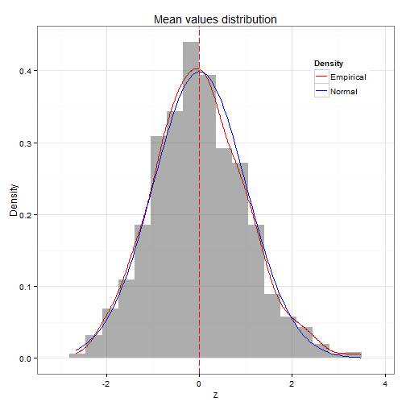

##Title: "Part 2: Analysis of the ToothGrowth data set"
*author: Ramaji*


*date: 19-MAR-2016*

*Course: Statistical Inference*
---
The `ToothGrowth` data set contains the length of odontoblasts (teeth) in each of 10 guinea pigs at each of three dose levels of Vitamin C (0.5, 1, and 2 mg) with each of two delivery methods (orange juice 
or ascorbic acid).
*[Ref.; C. I. Bliss (1952) The Statistics of Bioassay.Academic Press]*

### Quick exploration of the data set

For the purposes of this analysis, we will convert the dose variable into a factor.


```r
library(data.table)


library(knitr)

data(ToothGrowth)
tg<-as.data.table(ToothGrowth)
tgStat<-tg[,list(.N,mean(len),var(len)),by=list(supp,dose)]
colnames(tgStat)<-c("Supp","Dose","Size","Mean","Var")
kable(tgStat)
```


|Supp | Dose| Size|  Mean|       Var|
|:----|----:|----:|-----:|---------:|
|VC   |  0.5|   10|  7.98|  7.544000|
|VC   |  1.0|   10| 16.77|  6.326778|
|VC   |  2.0|   10| 26.14| 23.018222|
|OJ   |  0.5|   10| 13.23| 19.889000|
|OJ   |  1.0|   10| 22.70| 15.295556|
|OJ   |  2.0|   10| 26.06|  7.049333|
We will plot a graph to visulaize the distribution of tooth length by delivery method.


```r
library(ggplot2)
```

```
## Warning: package 'ggplot2' was built under R version 3.2.3
```

```r
ggplot(data=tg, aes(y=len, x=supp, fill=supp)) + geom_boxplot() +
    facet_wrap(~ dose, ncol=3) + ylab("Tooth length") + xlab("Delivery method") + 
    ggtitle("Tooth growth by delivery and dose") + 
    stat_summary(fun.y=mean, geom="point", shape=5, size=2) +
    theme_bw()
```



At dose levels of 0.5 and 1.0 mg the mean tooth length has greater dispersion for those where orange juice was used. For the 2 mg level, no noticeable difference in the mean was observed, but the dispersion for the OJ group seems to be smaller than VC group. 

### Multiple hypothesis testing

We will employ 2-sided unpaired t-tests to confirm whether there is a real difference between the groups by dose level and delivery method. We need to calculate the confidence intervals and p-values.

The comparison will be done at each dose level between delivery methods. Assume unequal variance. The p-values will be adjusted using the Bonferroni correction.

$H_0$ : There is no difference in the means between the two groups 


```r
ts1 <- lapply(c(.5, 1, 2), function(x) {
    t.test(len ~ supp, data=subset(tg, dose==x), paired=FALSE, var.equal=FALSE)
    })
pvals <- c(ts1[[1]]$p.value, ts1[[2]]$p.value, ts1[[3]]$p.value)
stats <- c(ts1[[1]]$statistic, ts1[[2]]$statistic, ts1[[3]]$statistic)
pAdjusted <- p.adjust(pvals, method = "bonferroni")
llimit <- sapply(c(ts1[[1]]$conf.int[1], ts1[[2]]$conf.int[1], ts1[[3]]$conf.int[1]), round, 3)
ulimit <- sapply(c(ts1[[1]]$conf.int[2], ts1[[2]]$conf.int[2], ts1[[3]]$conf.int[2]), round, 3)
df <- data.frame(dose=c(0.5, 1, 2), t=stats, p=pvals, adj=pAdjusted,
                 confInt=paste0("[",paste(llimit, ulimit, sep=", "), "]"))
colnames(df) <- c("Dose", "tStat", "p-value", "Adj. p-value", "CI")
kable(df,format="markdown")
```


| Dose|      tStat|   p-value| Adj. p-value|CI              |
|----:|----------:|---------:|------------:|:---------------|
|  0.5|  3.1697328| 0.0063586|    0.0190758|[1.719, 8.781]  |
|  1.0|  4.0327696| 0.0010384|    0.0031151|[2.802, 9.058]  |
|  2.0| -0.0461361| 0.9638516|    1.0000000|[-3.798, 3.638] |


### Conclusions

- We find the adjusted p-values are significant at the $\alpha$ = 0.05 level, and, the 95% confidence intervals do not include zero. At the dosage levels of 0.5 and 1 mg we find that there is statistically significant difference between the means of the OJ and VC groups.
- For the 2 mg dosage level we find the adjusted p-value to be much greater than 0.5, and the 95% confidence interval includes zero.  Hence we fail to reject the null hypothesis. It seems that at Vitamin C level, there is no significance influence of the delivery method on tooth growth in guinea pigs.
- We find, for testing the 2mg level, the current sample size of 10 is very small to provide any siginificant difference. We will need a much bigger sample size. Let us calculate the minimum sample size needed.


```r
groupSd <- sqrt(((tgStat$Size[3]-1)*tgStat$Var[3]+(tgStat$Size[6]-1)*tgStat$Var[6])/(tgStat$Size[3]+tgStat$Size[6]-2))
estSize <- round(power.t.test(power=0.9,delta=(tgStat$Mean[6]-tgStat$Mean[3]),sd=groupSd)$n,0)
cat("Effect error size:", round((tgStat$Mean[3]-tgStat$Mean[6])/groupSd, 3),"\nEstimated Size:",estSize)
```

```
## Effect error size: 0.021 
## Estimated Size: 49365
```


